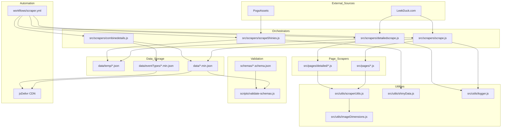
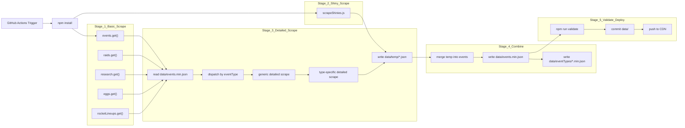
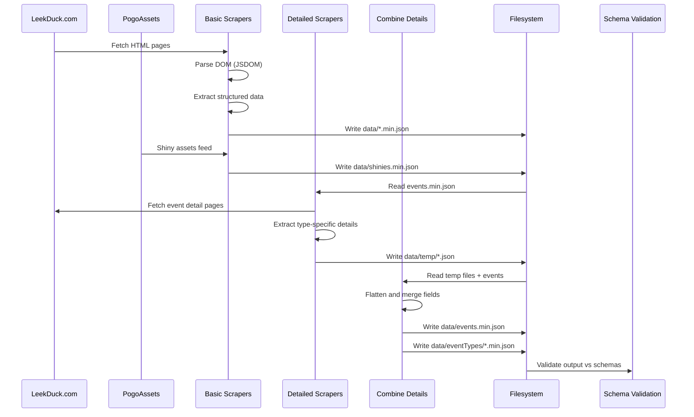
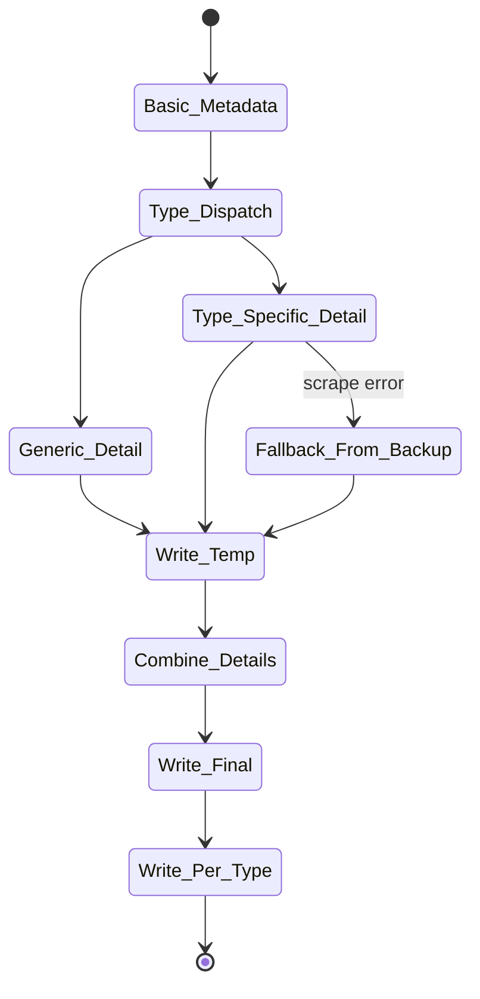
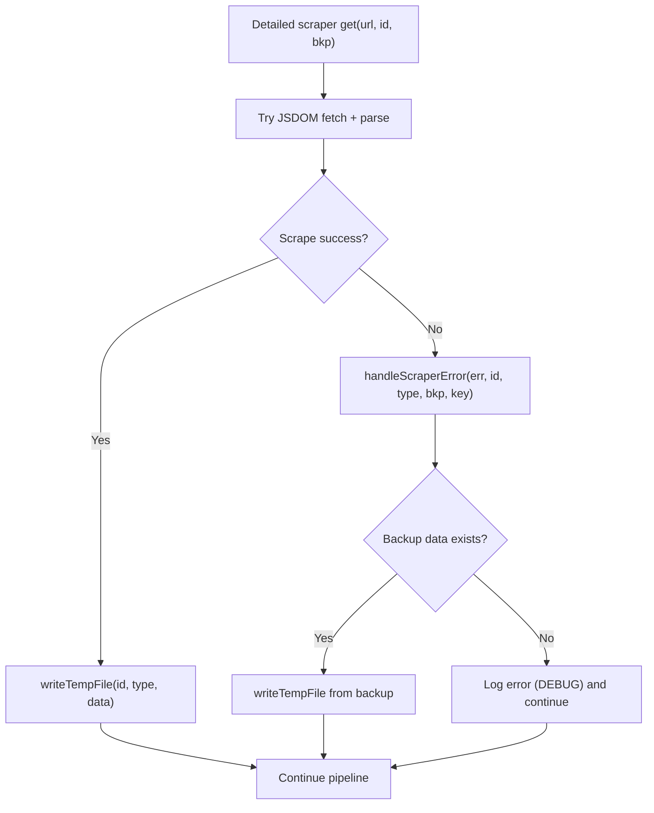
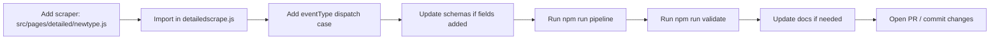

# Architecture Diagrams (Mermaid)

This document provides Mermaid.js diagrams for understanding the scrapedPoGo codebase. It is optimized for LLMs and developers who need quick architectural context.

## System Architecture (High Priority)

## Execution Flow (High Priority)

## Data Flow (High Priority)

## Component Interaction (Medium Priority)

```mermaid
flowchart TB
    S1["src/scrapers/scrape.js"] --> P1["src/pages/events.js"]
    S1 --> P2["src/pages/raids.js"]
    S1 --> P3["src/pages/research.js"]
    S1 --> P4["src/pages/eggs.js"]
    S1 --> P5["src/pages/rocketLineups.js"]

    S2["src/scrapers/detailedscrape.js"] --> D0["src/pages/detailed/generic.js"]
    S2 --> D1["src/pages/detailed/event.js"]
    S2 --> D2["src/pages/detailed/communityday.js"]
    S2 --> D3["src/pages/detailed/raidbattles.js"]
    S2 --> D4["src/pages/detailed/raidhour.js"]
    S2 --> D5["src/pages/detailed/raidday.js"]
    S2 --> D6["src/pages/detailed/timedresearch.js"]
    S2 --> D7["src/pages/detailed/season.js"]
    S2 --> D8["src/pages/detailed/gotour.js"]
    S2 --> D9["src/pages/detailed/teamgorocket.js"]
    S2 --> D10["src/pages/detailed/gobattleleague.js"]
    S2 --> D11["src/pages/detailed/maxbattles.js"]
    S2 --> D12["src/pages/detailed/maxmondays.js"]
    S2 --> D13["src/pages/detailed/gopass.js"]
    S2 --> D14["src/pages/detailed/pokestopshowcase.js"]
    S2 --> D15["src/pages/detailed/research.js"]
    S2 --> D16["src/pages/detailed/breakthrough.js"]
    S2 --> D17["src/pages/detailed/spotlight.js"]

    D0 --> U1["src/utils/scraperUtils.js"]
    D1 --> U1
    D2 --> U1
    D3 --> U1
    D4 --> U1
    D5 --> U1
    D6 --> U1
    D7 --> U1
    D8 --> U1
    D9 --> U1
    D10 --> U1
    D11 --> U1
    D12 --> U1
    D13 --> U1
    D14 --> U1
    D15 --> U1
    D16 --> U1
    D17 --> U1
```

## Event Processing State Machine (Medium Priority)

## Error Handling Flowchart (Medium Priority)

## Development Workflow (Medium Priority)

## Notes

- Mermaid diagrams render natively in GitHub markdown.
- All paths and script names match the current repository layout.
- Update diagrams when adding new event types or changing the pipeline.
